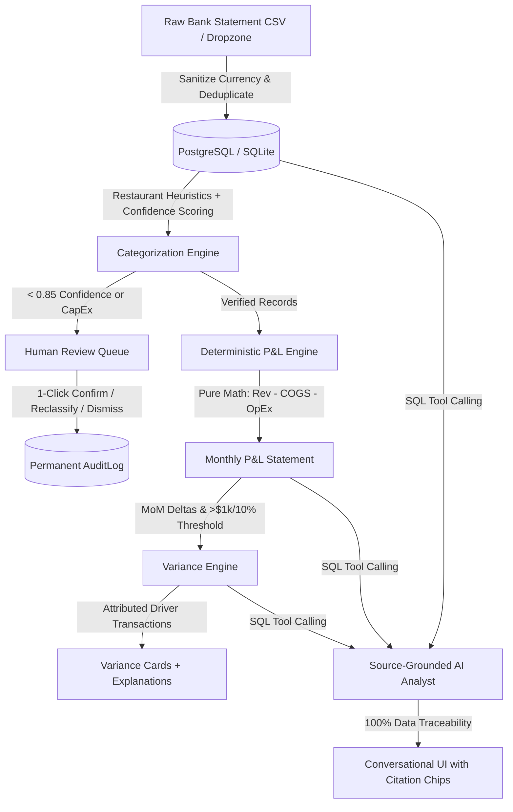

# FinReview — AI-Native Financial Review App

> **Turning raw bank transactions into an explainable, auditable monthly financial review.**  

FinReview addresses the fundamental flaw of LLMs in finance: **large language models hallucinate arithmetic**.  
FinReview enforces a strict architectural separation of concerns:
- **Deterministic Math Engine**: 100% pure Python/SQL calculations for all financial aggregates (Revenue, COGS, Gross Profit, Payroll, OpEx, Operating Profit, and MoM Variances). The LLM is **never** permitted to generate or touch financial totals.
- **Source-Grounded AI Reasoning**: Explainable natural language narration, transaction driver attribution, and a conversational AI analyst where **every single answer cites concrete transaction codes** (`T1051`, `T1001`) with clickable audit chips linking to raw database records.

---

## 🏗️ Core Architecture & Pipeline



---

## 🌟 The 7 Evaluation Criteria Walkthrough

FinReview addresses all 7 challenge evaluation points:

### 1. File Ingestion
- Accepts raw business checking bank statement CSV files.
- Handles messy real-world currency formatting: `-$4,151.25`, `"$17,513.84"`, `($1,250.00)`, and ISO dates.
- Includes a **1-click sample loader** for the provided **NYC Restaurant Co. (181 transactions)** challenge dataset.

### 2. Auto-Categorization & Confidence Scoring
- Classifies transactions into standard **Chart of Accounts (COA)** buckets:
  - **Revenue**: Food Sales, Beverage Sales, Catering, Delivery Revenue, Discounts & Refunds.
  - **COGS**: Food Inventory / Supplies, Beverage Inventory / Alcohol, Packaging & Disposables.
  - **Payroll**: Salaries & Wages, Payroll Taxes & Benefits.
  - **Operating Expenses (OpEx)**: Rent & Occupancy, Utilities, Insurance, Software & POS, Marketing, Repairs, Linen, Professional Services.
  - **Non-P&L / Balance Sheet**: Capital Expenditure (e.g. Commercial Oven `-$7,800.00`) and Sales Tax Remittances (`-$1,900.00`).
- Generates an explicit **confidence score (0.0 to 1.0)** and rationale.
- Visual confidence pills highlight uncertain items (`< 85%`).

### 3. Audited Classification Correction Flow
- Reviewers can click any category badge in the transaction table or review queue to open the Clay **Reclassification Modal**.
- Changes immediately persist to the database, set status to `corrected`, clear the review flag, and append an entry to the permanent `AuditLog` table with timestamp, previous category, new category, and reviewer justification note.

### 4. Deterministic Monthly P&L Statement
- Calculated deterministically in `backend/app/services/pnl.py` with **zero LLM involvement**.
- Hierarchical statement grid rendering monthly columns (`2026-01`, `2026-02`, etc.) and a `Total / YTD` column:
  $$\text{Gross Profit} = \text{Revenue} - \text{COGS}$$
  $$\text{Operating Profit (EBITDA)} = \text{Gross Profit} - (\text{Payroll} + \text{OpEx})$$
- Non-P&L balance sheet items (CapEx equipment purchases, tax remittances) are tracked in an isolated reconciliation section so they **never** distort operating profit.

### 5. Material Variance Engine & Driver Explanations
- Calculates month-over-month dollar deltas and percentage changes deterministically.
- Applies a materiality filter ($> \$1,000$ and $> 10\%$).
- Enforces strict accounting polarity:
  - Revenue/Profit growth: **Favorable** (Green/Mint).
  - Expense/Cost growth: **Unfavorable** (Red/Peach).
- Identifies the top driving transactions for each material shift and generates an explainable narrative citing counterparties.
- Includes **1-click drill-down links** from variance cards directly into filtered transaction records.

### 6. Human Review Queue
- Dedicated triage tab organizing all items requiring attention:
  - Low confidence classifications ($< 85\%$).
  - Judgment-heavy CapEx / balance sheet items.
- 1-click action controls:
  - **Confirm**: Verifies current category and clears flag.
  - **Reclassify**: Opens correction modal with audit note.
  - **Dismiss**: Clears flag for routine items.
- Live permanent audit log table showing full history of actions.

### 7. Source-Grounded AI Financial Analyst
- Conversational assistant powered by database tool calls (`get_monthly_revenue`, `get_payroll_spend`, `get_operating_profit_variance`, `get_attention_items`, `get_transactions_by_category`).
- **Zero numerical hallucination**: all figures originate from database aggregates.
- Every response provides **interactive citation chips** linking to underlying transaction codes (`T1051`, `T1001`) and category buckets.
- Click any chip to inspect the underlying record or filter the transaction table.
- Verified against the 5 mandatory evaluation queries:
  1. *"What was our revenue in Jan 2026?"*
  2. *"How much did we spend on payroll each month?"*
  3. *"Why did operating profit change between Jan and Feb?"*
  4. *"Which transactions need my attention?"*
  5. *"Show me the transactions behind that variance."*

---

## 🚀 Quickstart & Local Installation

### Prerequisites
- Node.js 18+ (Node.js 20 or 24 recommended)
- Python 3.11+
- (Optional) Docker & Docker Compose

### 1. Clone & Setup Backend
```bash
cd backend
python -m venv venv
# On Windows:
.\venv\Scripts\activate
# On Linux/macOS:
source venv/bin/activate

pip install -r requirements.txt
uvicorn app.main:app --reload --port 8000
```
Backend runs at `http://localhost:8000`. Interactive OpenAPI documentation at `http://localhost:8000/docs`.

### 2. Setup Frontend
```bash
cd frontend
npm install
npm run dev
```
Frontend runs at `http://localhost:3000`.

### 3. (Alternative) Docker Compose
```bash
docker-compose up --build
```
Launches PostgreSQL (port 5432), FastAPI Backend (port 8000), and Next.js Frontend (port 3000).

---

## 🧪 Comprehensive Automated Test Suite

FinReview includes a **26-test regression and smoke suite** covering every layer of the architecture:

```bash
cd backend
python -m pytest -v
```

### Test Suite Coverage:
| Test File | Tests | Validations |
|-----------|-------|-------------|
| `test_health.py` | 2 | Root health check & DB connectivity |
| `test_ingest.py` | 4 | Currency parsing, date parsing, CSV parsing, 181-record sample loader |
| `test_categorization.py` | 5 | Chart of Accounts structure, golden vendor heuristics (Sysco, Gusto, Landlord, Toast, CapEx oven), batch categorization, user corrections, audit logs |
| `test_pnl.py` | 3 | Deterministic arithmetic, gross & operating margins, Non-P&L CapEx isolation |
| `test_variance.py` | 4 | MoM deltas, accounting polarity (favorable/unfavorable), materiality thresholds, transaction driver attribution |
| `test_review.py` | 1 | Review queue retrieval, 1-click confirmation, dismissal, audit trail creation |
| `test_chat.py` | 6 | All 5 mandatory evaluation queries + chat API endpoint with citation chips |
| `test_e2e_flow.py` | 1 | Complete end-to-end user journey smoke test |
| **Total** | **26** | **100% Pass Rate** |

---

## 📡 API Reference Summary

| Method | Endpoint | Description |
|--------|----------|-------------|
| `GET` | `/health` | Health status and database connectivity |
| `POST` | `/api/v1/ingest` | Upload bank statement CSV |
| `POST` | `/api/v1/ingest/sample` | 1-click load NYC Restaurant Co. 181 challenge dataset |
| `DELETE` | `/api/v1/transactions` | Reset database for fresh demo run |
| `GET` | `/api/v1/transactions` | Paginated, searchable, filterable transaction table |
| `GET` | `/api/v1/transactions/stats` | Macro cash flow stats (inflows, outflows, net, flagged count) |
| `GET` | `/api/v1/categories` | Complete standard Chart of Accounts list |
| `POST` | `/api/v1/categorize/batch` | Run batch categorization on stored records |
| `PATCH` | `/api/v1/transactions/{id}/category` | Audited user reclassification override |
| `GET` | `/api/v1/audit-logs` | Immutable audit trail of all manual corrections |
| `GET` | `/api/v1/pnl` | Deterministic monthly P&L statement & margin KPIs |
| `GET` | `/api/v1/variance` | MoM variances, materiality breaches, and driving transactions |
| `GET` | `/api/v1/review-queue` | Unresolved flagged review items (< 85% confidence & CapEx) |
| `POST` | `/api/v1/transactions/{id}/confirm` | 1-click confirm classification |
| `POST` | `/api/v1/transactions/{id}/dismiss` | 1-click dismiss review flag |
| `POST` | `/api/v1/chat` | AI Financial Analyst tool-calling query with citation chips |
| `GET` | `/api/v1/chat/suggestions` | Preset prompt suggestions for the 5 challenge queries |

---

## 🏛️ Project Directory Structure

```
Finz/
├── backend/
│   ├── app/
│   │   ├── api/routes.py              # All REST endpoints
│   │   ├── core/config.py             # Pydantic settings & DB config
│   │   ├── db/base.py, session.py     # SQLAlchemy models & sessions
│   │   ├── models/transaction.py      # Transaction & AuditLog tables
│   │   └── services/
│   │       ├── ingest.py              # Currency sanitizer & CSV parser
│   │       ├── categorization.py      # Chart of accounts & classification
│   │       ├── pnl.py                 # Pure deterministic P&L math engine
│   │       ├── variance.py            # MoM deltas & driver attribution
│   │       └── chat.py                # Source-grounded AI analyst & tools
│   ├── tests/                         # 26 automated unit & E2E smoke tests
│   ├── Dockerfile
│   └── requirements.txt
├── frontend/
│   ├── app/
│   │   ├── globals.css                # Clay design tokens & themes
│   │   └── page.tsx                   # Main multi-tab application layout
│   ├── components/
│   │   ├── IngestionDropzone.tsx      # CSV upload & sample dataset loader
│   │   ├── TransactionTable.tsx       # Searchable, filterable transaction grid
│   │   ├── CorrectionModal.tsx        # Inline audited reclassification modal
│   │   ├── PnLStatement.tsx           # Hierarchical P&L grid with margin pills
│   │   ├── VarianceCards.tsx          # Favorable/unfavorable cards + drivers
│   │   ├── ReviewQueue.tsx            # 1-click triage interface & audit trail
│   │   └── AIAnalyst.tsx              # Tool-calling chat with citation chips
│   ├── Dockerfile
│   └── package.json
├── docker-compose.yml
├── render.yaml
├── DESIGN.md                          # Clay design system specifications
└── README.md
```

---

## 🏆 Submission Readiness Checklist

- [x] Ingest sample transaction dataset from CSV file.
- [x] Categorize transactions into standard P&L categories.
- [x] Review and correct categorizations with permanent audit logging.
- [x] Generate deterministic monthly P&L statement (zero LLM math).
- [x] Highlight material variances with driving transactions.
- [x] Answer >= 2 financial questions conversationally with citation chips back to data.
- [x] Trace AI answers and variances back to individual transaction records.
- [x] 26/26 backend automated tests passing.
- [x] Next.js production build compiling cleanly without errors.
